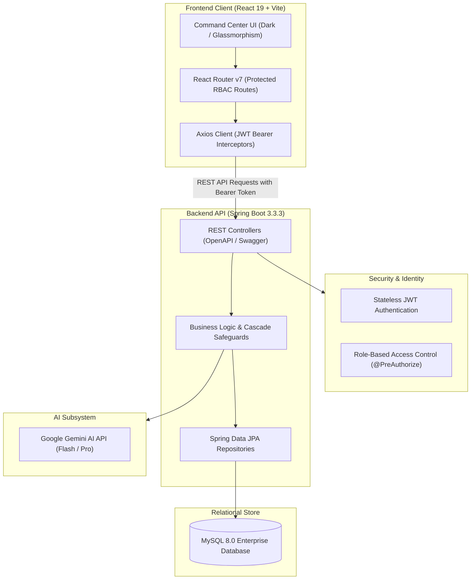

# NeuroForge Enterprise SDLC Platform ⚡

[](https://www.oracle.com/java/)
[](https://spring.io/projects/spring-boot)
[](https://react.dev/)
[](https://vitejs.dev/)
[](https://www.mysql.com/)
[](https://deepmind.google/technologies/gemini/)
[](https://jwt.io/)
[](LICENSE)

> **Autonomous, AI-Augmented Enterprise Software Development Life Cycle Platform**  
> Unifying project governance, AI PRD synthesis, agile sprint execution, automated code intelligence, QA telemetry, and release command orchestration in a single high-performance engineering suite.

---

## 📑 Table of Contents
- [Executive Overview](#-executive-overview)
- [System Architecture](#-system-architecture)
- [Enterprise SDLC Modules](#-enterprise-sdlc-modules)
- [Technology Stack](#-technology-stack)
- [Security & RBAC Matrix](#-security--rbac-matrix)
- [Database Schema & ER Design](#-database-schema--er-design)
- [Local Setup & Installation](#-local-setup--installation)
- [Default Seed Accounts & Testing](#-default-seed-accounts--testing)
- [API Documentation & Swagger](#-api-documentation--swagger)
- [License](#-license)

---

## 🌟 Executive Overview

In traditional software organizations, engineering workflows are fractured across multiple disconnected tools: Jira for task tracking, Confluence for documentation, isolated AI plugins for code suggestions, TestRail for QA, and Jenkins/GitLab for deployment pipelines. This fragmentation creates information silos, delayed handoffs, and lack of visibility.

**NeuroForge Enterprise SDLC** solves this by unifying every critical phase of the software engineering life cycle into a centralized, military-grade command center:
1. **Autonomous Requirements Engineering**: Instant synthesis of structured PRDs, epics, and user stories with Gherkin acceptance criteria powered by Google Gemini AI.
2. **Real-time Sprint Telemetry**: Agile sprint workflows with live task status updates and automated workload attribution.
3. **Personalized My Work Command Center**: Individualized engineering dashboards showing active sprint tasks, assigned defect queues, and 1-click launchpads.
4. **Integrated QA Matrix**: Full traceability between user stories, test cases, execution runs, and defect triage.
5. **Release Governance**: Production staging, CI/CD audit logs, and approval signoffs with automated integrity constraints.

---

## 🏛 System Architecture



---

## 📦 Enterprise SDLC Modules

| # | Module | Core Functionality |
|---|---|---|
| **01** | **Personalized Work Command Center** | Real-time dashboard displaying assigned tasks, active defect triage blockers, project ownerships, and 1-click action shortcuts. |
| **02** | **Project Governance & Portfolios** | Multi-project tracking, project key allocation, ownership assignments, and Admin cascade project deletion safeguards. |
| **03** | **Team Workspace & RBAC Directory** | Organization directory with role assignments (`ADMIN`, `PROJECT_MANAGER`, `DEVELOPER`, `TESTER`, etc.) and secure user administration. |
| **04** | **Requirements Engineering** | Hierarchical requirements management (Functional / Non-Functional), user stories, and story point estimations. |
| **05** | **Autonomous AI PRD Studio** | Generative AI assistant (Google Gemini) that converts high-level prompts into user stories with Gherkin syntax (`Given-When-Then`). |
| **06** | **Sprints & Task Execution** | Sprint planning milestones, date boundaries, goal setting, task assignments, and swimlane progression (`To Do`, `In Progress`, `Code Review`, `Done`). |
| **07** | **AI Code Intelligence Studio** | Autonomous code snippet generation, unit test creation, complexity assessment, and syntax analysis. |
| **08** | **Quality Assurance & Defect Tracking** | Test case authoring matrix, execution run logging (`PASSED`, `FAILED`, `BLOCKED`), pass-rate telemetry, and defect triage. |
| **09** | **Release Command Center** | Deployment gates, staging-to-production promotion, version tracking (`v1.0.0`), and deployment audit logs. |

---

## 💻 Technology Stack

### Backend
* **Language & Framework**: Java 17, Spring Boot 3.3.3
* **Security**: Spring Security 6, JJWT (`0.12.6`) stateless JWT token handling
* **Persistence**: Spring Data JPA, Hibernate ORM, HikariCP Connection Pooling
* **Database**: MySQL 8.0 with InnoDB engine and cascade referential integrity
* **API Documentation**: SpringDoc OpenAPI 3 (`v2.6.0`) with Swagger UI
* **Utilities**: Project Lombok, Jakarta Validation (`spring-boot-starter-validation`)
* **AI Integration**: Google Gemini REST API (Gemini 3.6 Flash / Pro)

### Frontend
* **Core Framework**: React 19, Vite 8.2 (ESM)
* **Routing**: React Router DOM v7
* **HTTP Client**: Axios 1.20 with request/response interceptors for Bearer auth
* **Icons & Visuals**: Lucide React
* **Styling**: Modern dark command center theme (`#000000` deep black, `#ff6b00` electric orange, glassmorphism, responsive grid layouts)

---

## 🛡 Security & RBAC Matrix

NeuroForge enforces strict role-based access control at both the API controller layer (`@PreAuthorize`) and client router layer (`ProtectedRoute`):

| Role | Projects | Sprints & Tasks | AI Studios | QA & Issues | Releases | User Admin |
|---|:---:|:---:|:---:|:---:|:---:|:---:|
| `ROLE_ADMIN` | Full (Create/Delete) | Full | Full | Full | Full | Full |
| `ROLE_PROJECT_MANAGER` | Create / Manage | Full | Full | Review | Stage / Deploy | View Directory |
| `ROLE_DEVELOPER` | View Assigned | Create / Update | Code & PRD | Log Defects | View Audit | - |
| `ROLE_TESTER` | View Assigned | View / Update | - | Full (Test Cases & Bugs) | View | - |
| `ROLE_BUSINESS_ANALYST` | View Assigned | Backlog | PRD Studio | View | - | - |
| `ROLE_DEVOPS_ENGINEER` | View | View | Code Studio | View | Full (Deploy / Audit) | - |

---

## 🗄 Database Schema & ER Design

The database schema is structured for enterprise scalability and strict referential integrity. All foreign keys feature defensive cascade or unlinking constraints (`ON DELETE CASCADE`, `ON DELETE SET NULL`) to prevent orphan records.

### Core Tables
1. **`users`**: Enterprise accounts, password hashes, and RBAC authorities.
2. **`projects`**: Top-level project governance containers with owner associations.
3. **`teams` & `team_members`**: Cross-functional team workspaces and project assignments.
4. **`requirements` & `user_stories`**: Functional requirements and story specifications.
5. **`sprints`**: Time-boxed execution milestones with status tracking (`Planned`, `Active`, `Completed`).
6. **`tasks`**: Engineering work items with priority, assignee, story, and sprint relations.
7. **`test_cases` & `test_runs`**: QA suites, execution steps, expected outcomes, and run logs.
8. **`issues`**: Defect triage items linked to tasks, reporters, and assignees.
9. **`releases` & `deployments`**: Deployment pipelines, audit logs, and environment gates.

*The full SQL schema script is available in [`NeuroForge_Enterprise_SDLC_Database.sql`](NeuroForge_Enterprise_SDLC_Database.sql), and the database modeling file is located at [`ER diagram.mwb`](ER%20diagram.mwb).*

---

## 🚀 Local Setup & Installation

### 1. Prerequisites
- **Java Development Kit (JDK)**: Version 17 or higher
- **Apache Maven**: Version 3.8+ (or use the included Maven wrapper)
- **Node.js**: Version 18.x or higher & `npm`
- **MySQL Server**: Version 8.0 or higher
- **Git**

---

### 2. Database Initialization
1. Start your local MySQL service.
2. Open your terminal or MySQL Workbench and run:
   ```sql
   CREATE DATABASE neuroforge_enterprise_sdlc CHARACTER SET utf8mb4 COLLATE utf8mb4_unicode_ci;
   ```
3. Import the provided schema and seed data:
   ```bash
   mysql -u root -p neuroforge_enterprise_sdlc < NeuroForge_Enterprise_SDLC_Database.sql
   ```

---

### 3. Backend Configuration & Launch
1. Navigate to the backend directory:
   ```bash
   cd backend
   ```
2. Create or verify `src/main/resources/application-local.properties` (gitignored for security):
   ```properties
   spring.datasource.url=jdbc:mysql://localhost:3306/neuroforge_enterprise_sdlc?useSSL=false&serverTimezone=UTC&allowPublicKeyRetrieval=true
   spring.datasource.username=root
   spring.datasource.password=YOUR_MYSQL_PASSWORD

   # Google Gemini AI API Configuration
   neuroforge.ai.gemini.api-key=YOUR_GEMINI_API_KEY
   neuroforge.ai.gemini.model=gemini-3.6-flash
   ```
3. Build and run the Spring Boot application:
   ```bash
   mvn clean spring-boot:run
   ```
   *The backend server will start on port `8080` (API base: `http://localhost:8080/api`).*

---

### 4. Frontend Configuration & Launch
1. Open a separate terminal and navigate to the frontend directory:
   ```bash
   cd frontend
   ```
2. Install npm dependencies:
   ```bash
   npm install
   ```
3. Start the Vite development server:
   ```bash
   npm run dev
   ```
4. Access the web application in your browser at:
   ```
   http://localhost:5173
   ```

---

## 👥 Default Seed Accounts & Testing

The database includes pre-configured enterprise demo accounts for testing all access tiers:

| Email Address | Password | Role |
|---|---|---|
| `adminneuroforge@gmai.com` | `password123` | **Admin** (Full System Authority) |
| `pmneuroforge@gmai.com` | `password123` | **Project Manager** |
| `dev1neuroforge@gmai.com` | `password123` | **Developer 1** |
| `dev2neuroforge@gmai.com` | `password123` | **Developer 2** |
| `baneuroforge@gmai.com` | `password123` | **Business Analyst** |
| `qa1neuroforge@gmai.com` | `password123` | **QA Engineer 1 (Tester)** |
| `devops1neuroforge@gmai.com` | `password123` | **DevOps Engineer** |

---

## 📑 API Documentation & Swagger

When the backend application is running, interactive Swagger / OpenAPI documentation is accessible at:
- **Swagger UI**: [http://localhost:8080/swagger-ui.html](http://localhost:8080/swagger-ui.html)
- **OpenAPI JSON Spec**: [http://localhost:8080/v3/api-docs](http://localhost:8080/v3/api-docs)

A complete Postman test collection with sample payloads for all endpoints is also included in [`NeuroForge_Postman_Collection.json`](NeuroForge_Postman_Collection.json).

---

## 📜 License

This project is licensed under the MIT License - see the [LICENSE](LICENSE) file for details.
